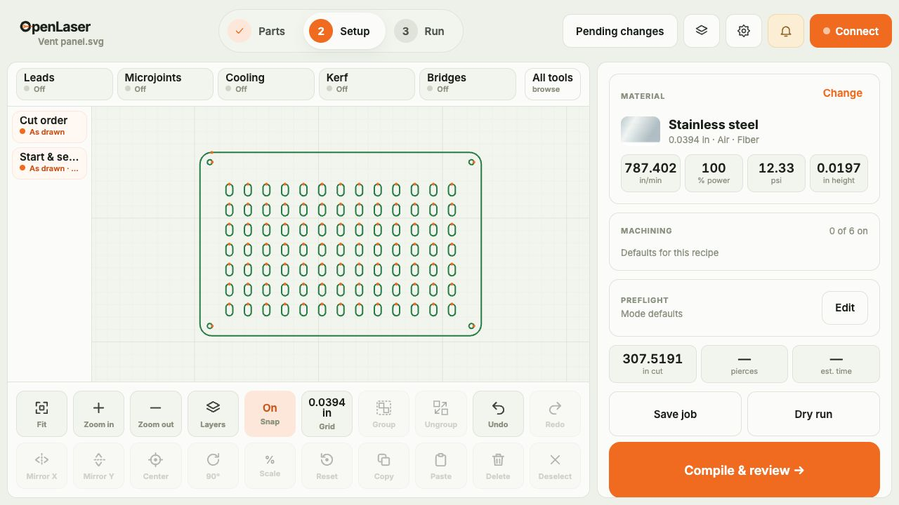
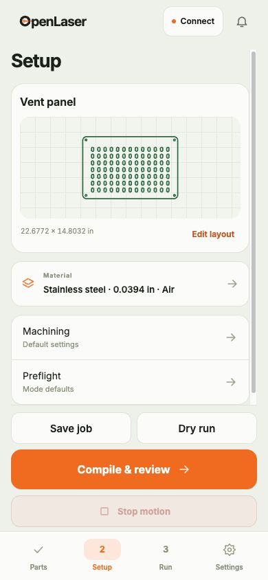

<p align="center">
  <picture>
    <source media="(prefers-color-scheme: dark)" srcset="ui/static/logo-white.svg">
    <source media="(prefers-color-scheme: light)" srcset="ui/static/logo.svg">
    
  </picture>
</p>

<p align="center"><strong>Laser control, from drawing to cut.</strong></p>

<p align="center">
  <a href="https://www.youtube.com/watch?v=mE4t7rmcuec">
    
  </a>
  <br>
  <sub>▶ Watch the overview on YouTube</sub>
</p>

Open-source control software for fiber and CO₂ laser cutters using the MCC100
motion controller, including the Au3tech NexCut X1 card in Gweike M-series
machines supplied with M-Laser.

OpenLaser brings drawing import, cut preparation, material recipes and machine
control into one application. A Rust server runs on the machine PC and serves
a touch interface on the desktop and phones on the local network. Your parts,
jobs and settings stay on that PC.

**0.1.0-alpha.4.1 — source alpha.** This repository contains source and documentation;
prebuilt application binaries are not published. Automated checks cover offline
preparation, compilation and a loopback controller simulator. Physical
compatibility and commissioning across machine variants remain unverified. Keep
the machine's emergency stop accessible and supervise operation.

**[Setup and operator manual](USAGE.md)** · [Changes](CHANGELOG.md) ·
[Build and release instructions](RELEASING.md)



*Desktop setup with a sample part in the simulator.*

## What it does

- **Parts and jobs:** import DXF and SVG drawings, turn text into outlines, and
  keep reusable parts, saved jobs and material recipes in a local library.
- **Cut preparation:** kerf compensation, leads, micro-joints, bridges, cooling
  and cut order, with a preview before running.
- **Nesting:** arrange quantities across numbered sheets with spacing, grain,
  stock outlines and saved remnants, using Sparrow.
- **Machine control:** connect, home, jog, frame, Start, Pause, Resume and Stop,
  with alarms, preflight/pause/postflight checklists, and restart controls.
- **Machine setup:** import vendor XML backups, edit machine settings and
  material recipes, and apply nine-point matrix correction.
- **Desktop and phone:** the same Parts → Setup → Run → Settings workflow,
  shared workspace and machine session, with metric or imperial display units.
- **Built-in simulator:** develop and explore the workflow without a controller.

STEP import, fill and scan engraving, fly cutting, camera integration and
automatic updates are outside the current scope.

## Try it without a machine

Install Rust **1.97+**, Node.js **22.12+**, and
[just](https://github.com/casey/just), then run from the repository root:

```sh
just ui-install
just ui-build
cargo run -p openlaser -- --simulate --no-browser --data ./data/simulator
```

Open [127.0.0.1:8080](http://127.0.0.1:8080). The simulator uses its own data
directory in this example. Connect and home the simulated machine through the
interface before exercising machine controls. For a fresh source checkout,
first import `fixtures/xml/harness-backup.xml` under Settings → Machine settings
as the synthetic simulator configuration. Never use that fixture for a real
machine.

## Build from source

```sh
just ui-install
just standalone
```

The release executable is `target/release/openlaser` on macOS and Linux, or
`target/release/openlaser.exe` on Windows. It embeds the UI, fonts, material
artwork and license notices.

On Windows, `just standalone` downloads Microsoft's WebView2 bootstrapper and
verifies its pinned SHA-256 hash before embedding it. The installer remains a
local build input and is excluded from Git. Cross-compilation and packaging
instructions are in [RELEASING.md](RELEASING.md).

The bundled material library includes 50 metal recipes from the supplied clean
Mlaser library, plus the existing basswood recipe. Metal recipes use OpenLaser's
default artwork and offer editable nozzle diameter, nozzle type and manual focus.

The native window uses WebKit on macOS, WebView2 on Windows, and WebKitGTK on
Linux. Linux builds require GTK 3 and WebKitGTK 4.1 development packages
(`libwebkit2gtk-4.1-dev` on Debian/Ubuntu). Use an MSVC Rust target for a
single-file Windows build; a missing WebView2 runtime requires a one-time
online setup. See the [application guide](USAGE.md#install-and-launch)
for installation and [RELEASING.md](RELEASING.md) for cross-compilation and
versioned packaging.

The application starts disconnected. Closing its native window stops the
machine session and waits for the Rust service to exit. Use `--no-browser`
for a server that runs independently, and `openlaser --shutdown` to stop it,
with the same `--data` or `--config` arguments if supplied at launch.

## Use a phone on the shop network

The desktop app shares on the shop network by default. For a headless server,
launch with `--lan`, or enable `lan = true` in `machine.toml`, then open
[openlaser.local](http://openlaser.local) on the same network. `/mobile` opens
the phone layout explicitly; `/app` opens the full desktop layout.

LAN sharing uses HTTP port 80 by default and assumes a trusted local network:
there are no accounts or pairing codes. One screen controls the workspace at
a time, and every screen can stop motion. The host must allow the HTTP port
and multicast DNS; discovery status appears in the Local network panel.

<p align="center">
  
</p>

*The same sample part in the phone interface.*

For the complete workflow, placement, sheet history, remnants, restart, machine
settings, data storage and network configuration, see the
[setup and operator manual](USAGE.md).

## Development

The backend is a Rust workspace; the UI uses Svelte and TypeScript. Protocol
encoding and compilation are separate from the controller session, disk
storage and HTTP server.

| Area | Crates / directory |
| --- | --- |
| Geometry and preparation | `openlaser-core`, `openlaser-prep`, `openlaser-correction`, `openlaser-nest` |
| Import | `openlaser-dxf`, `openlaser-svg`, `openlaser-xml` |
| Controller format and compilation | `openlaser-protocol`, `openlaser-compiler` |
| Machine session and simulator | `openlaser-controller` |
| Storage and networking | `openlaser-library`, `openlaser-network` |
| API and executable | `openlaser-server`, `openlaser` |
| Desktop and phone interface | `ui/` |

Run the same checks as CI:

```sh
cargo install cargo-deny
just check
```

For UI development, run the simulator command above in one terminal and
`just ui-dev` in another. Contributions should include relevant regression tests and keep touch controls
usable. Read [CONTRIBUTING.md](CONTRIBUTING.md) for the workflow.

## License

[GNU GPL v3.0 or later](LICENSE). Bundled third-party assets retain their own
license notices.
